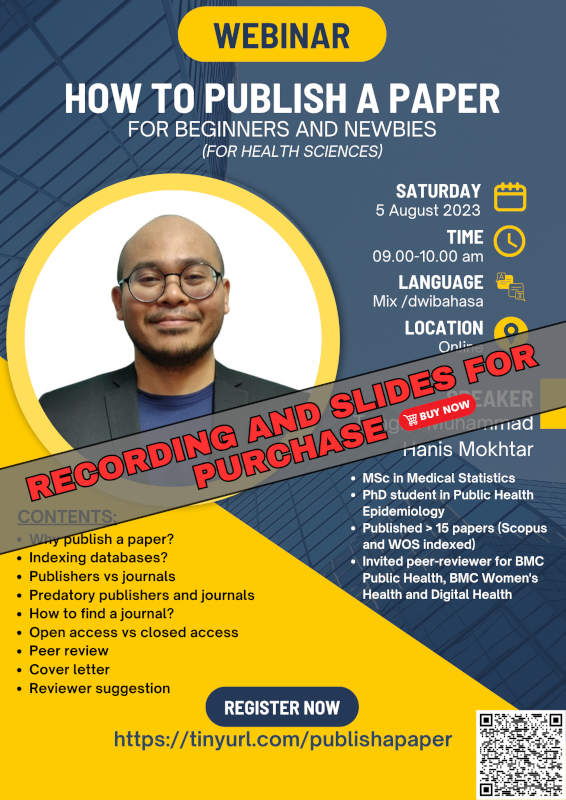

{width="350"}

The recording and slides of this webinar is available for purchase:

-   Title: How to publish a paper for beginners and newbies (for health sciences)
-   Language: English
-   Price: RM10
-   Content:
    1.  Why publish a paper?
    2.  Indexing databases?
    3.  Publishers vs journals
    4.  Predatory publishers and journals
    5.  How to find a journal?
    6.  Open access vs closed access
    7.  Peer review
    8.  Cover letter
    9.  Reviewer suggestion

[Go to Recordings](../../recording.qmd)