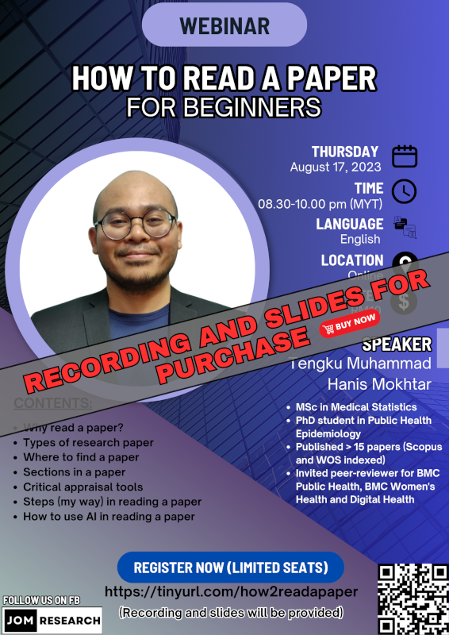

{width="303"}

The material for this webinar is available for purchase:

-   Title: How to read a paper for beginners
-   Language: English
-   Price: RM10
-   Content:
    1.  Why read a paper?
    2.  Types of research paper
    3.  Where to find a paper
    4.  Sections in a paper
    5.  Critical appraisal tools
    6.  Steps (my way) in reading a paper
    7.  How to use AI in reading a paper

[Go to Recordings](../../recording.qmd)