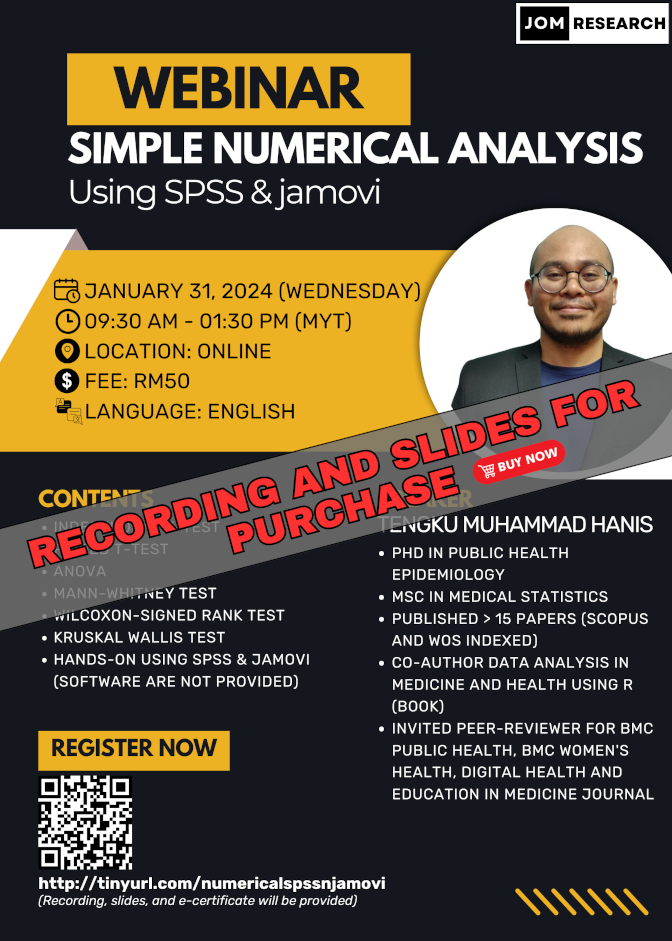

{width="305"}

The material for this webinar is available for purchase:

-   Title: Simple numerical analysis using SPSS & jamovi
-   Language: English
-   Price: RM50 (recording, slides, and dummy data)
-   Prerequisite: Basic knowledge of SPSS and jamovi, you can either:
    -   Buy our webinars' recording - [An introduction to SPSS & jamovi - RM30](../2023-09-29-an-introduction-to-spss-jamovi/index.md)
    -   Or watch some introductory videos on SPSS & jamovi on YouTube
-   Content:
    1.  Independent t-test and Welch's t-test
    2.  Paired t-test
    3.  One-way ANOVA and Welch's ANOVA
    4.  Mann-Whitney test
    5.  Wilcoxon signed-rank test
    6.  Kruskal Wallis test
    7.  Hands-on using spss & jamovi (software are not provided)

[Go to Recordings](../../recording.qmd)