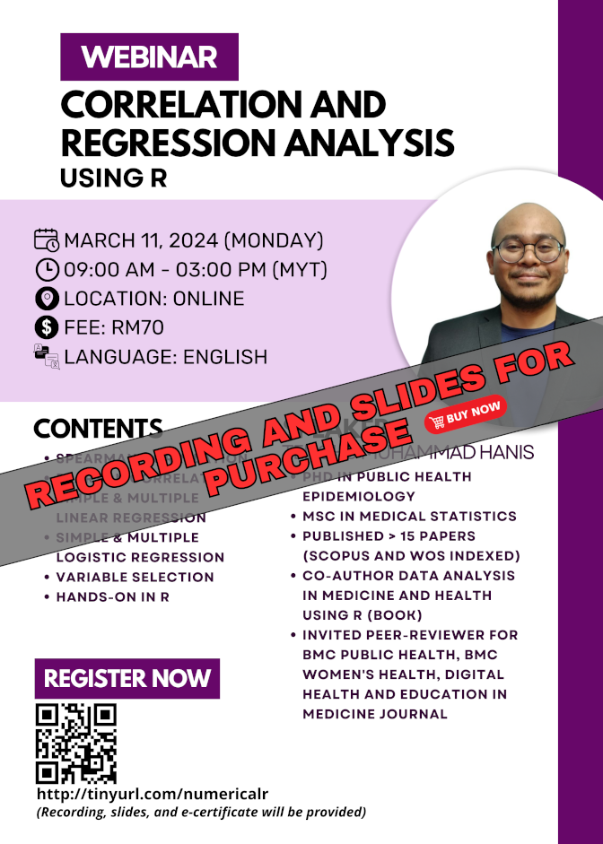

{width="305"}

The material for this webinar is available for purchase:

-   Title: Correlation and regression analysis using R
-   Language: English
-   Price: RM70 (recording, slides, dummy data, and R codes)
-   Prerequisite: Basic knowledge of R, for those without the basics, you can either:
    -   Buy our webinar recording: [Intro to R (for non-coders) - RM50](../2023-10-12-intro-to-r-for-non-coders/index.md)
    -   Or watch some introductory videos on R on YouTube
-   Content:
    1.  Spearman correlation
    2.  Pearson correlation
    3.  Simple & multiple linear regression
    4.  Simple & multiple logistic regression
    5.  Variable selection
    6.  Related concepts such as interaction, outliers, and multicollinearity
    7.  Hands-on using R

[Go to Recordings](../../recording.qmd)